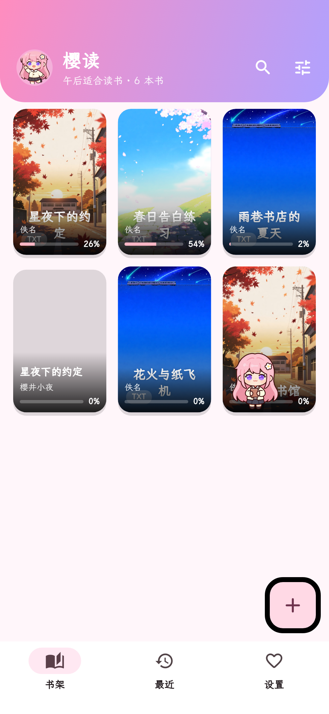
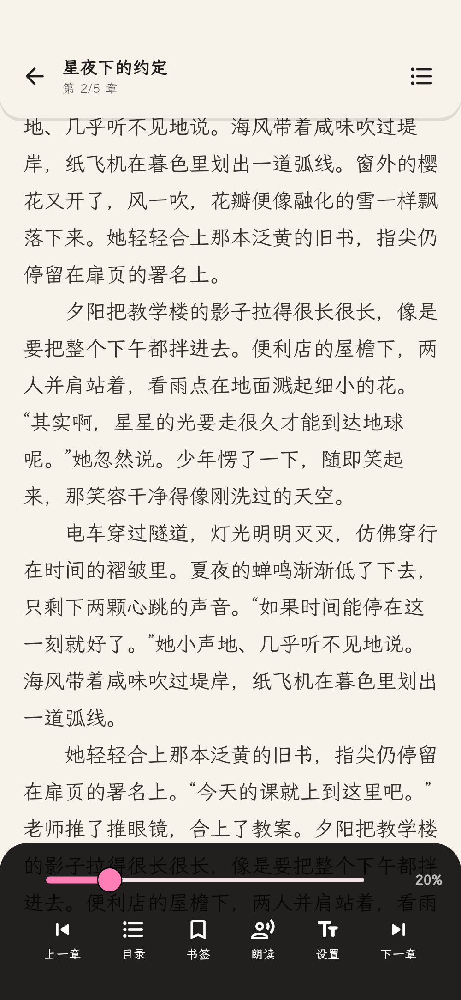
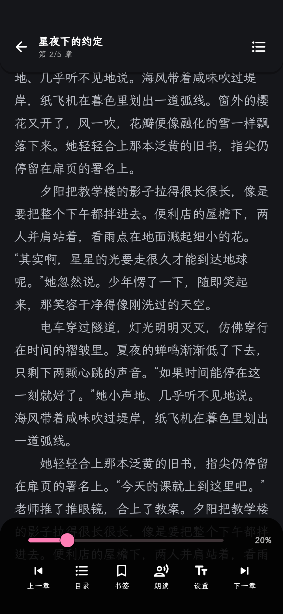
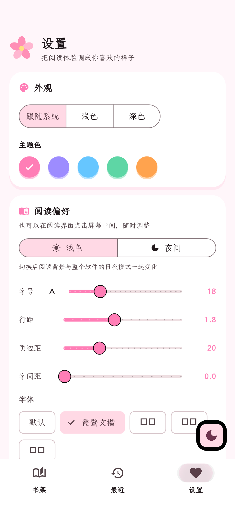
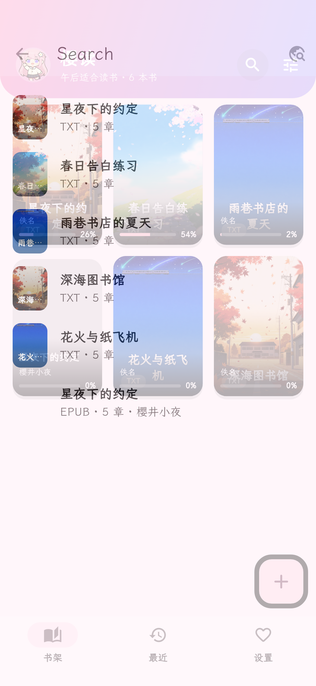

<div align="center">


# 樱读 · Sakura Read

**在樱花树下，慢慢读完一本书。**

一款**二次元风格的 Android 小说阅读器**：本地 TXT / EPUB 阅读 + 兼容「阅读 3.0」书源的在线搜书，自带一只会撒娇、会生气、还会捣乱的**看板娘桌宠**。

[]()
[]()
[]()
[]()
[]()

[功能特性](#-功能特性) · [截图预览](#-截图预览) · [下载安装](#-下载安装) · [从源码构建](#-从源码构建) · [常见问题](#-常见问题)

</div>

---

## ✨ 为什么是「樱读」？

市面上的阅读器很多，但我们想做的不只是一款"能看书"的工具：

- 🎀 **她是活的** —— 一位粉发看板娘陪着你：会跟你打招呼、被你拖来拖去、看书时在你书页上跑来跑去，惹急了还会……（彩蛋自己找）
- 🌸 **她是漂亮的** —— 从图标、开屏、封面到空书架，整套日系赛璐璐上色的二次元皮肤，由 AI 素材管线精心打磨
- 📖 **她是很能干的** —— TXT / EPUB 全格式、4 种翻页、TTS 朗读、书签统计、多源搜书、一键换源，该有的一个不少
- 🔓 **她是开源的** —— MIT 协议，代码干净、测试充分（193 项自动化测试），欢迎你来改

---

## 🎀 自带看板娘「小樱」

| 能力 | 说明 |
| --- | --- |
| 🌸 **全局悬浮** | 自由拖动（拖到哪停在哪）、位置记忆、呼吸浮动，拖动时有摇晃感 + 落地小跳 + 随机台词 |
| 💬 **点击互动** | 屏幕内随机弧线蹦跳 + 可爱台词 + 亲密度 +1（每日上限 20） |
| 🫶 **双击摸头** | 害羞差分 + 头顶飘心 + 亲密度 +2（每日上限 10） |
| 😴 **打瞌睡** | 深夜时段或长时间无互动自动入睡（睡容差分），一碰就醒 |
| 😠 **生气系统** | 被反复拖动 / 睡觉被叫醒 / 频繁点击 → 生气表情 + 专属台词（**生气不涨好感度**） |
| 🏃 **奔跑乱跑** | 会自己在屏幕上到处跑（小步起伏 + 弧线路径 + 前倾），**阅读时高频捣乱** |
| 🍡 **点心投喂** | 只靠阅读时长兑换：樱饼（20 分）/ 团子（1 时）/ 大福（5 时）/ 蛋糕（20 时） |
| 💗 **亲密度 7 级** | 初遇 → 相识 → 书友 → 好友 → 知己 → 亲密 → 挚爱，台词随等级变化（7 档 21 句） |
| 🖤 **隐藏彩蛋** | 生气第 4 次起才有概率触发……触发之后嘛，自己去看（提示：返回键也没用） |

<div align="center">


</div>

<div align="center">

&nbsp;&nbsp;

</div>

> 看板娘的每一次点击、每一次拖动，都可能换来一个新的表情与台词。

---

## 📖 功能特性

### 📚 书架 & 本地阅读

- **格式支持**：TXT（UTF-8 / UTF-16 / GBK 自动探测）、EPUB（EPUB2 NCX / EPUB3 nav 双目录解析 + 封面提取）
- **导入方式**：内置文件浏览器多选导入、批量扫描常见目录
- **排列方式**：6 种排序（最近阅读 / 添加时间 / 书名 / 作者 / 阅读进度 / 字数）× 正序倒序 × 3 种样式（网格 / 小图 / 列表）
- **智能封面**：优先真实封面；无封面时按书名稳定分配 6 张 AI 场景插画

### 📖 沉浸式阅读器

- **四种翻页**：滑动 / 覆盖（跟手滑出 + 前缘投影，对照阅读 3.0 逐行移植）/ 淡入 / 滚动
- **排版调节**：字号 / 行距 / 字距 / 页边距 / 首行缩进；内置「霞鹜文楷」字体 + 4 种备选
- **6 种背景**：纸白 / 米黄 / 护眼绿 / 浅灰 / 夜间 / 纯黑，日夜间一键切换（全局主题同步）
- **跨章连页**：翻越章界与常规翻页同样顺滑（相邻章节静默预加载）
- **页眉页脚**：章节名 / 时间 / 页码进度 / 电量，沉浸在状态栏里
- **书签系统**：阅读器内收藏 + 设置页跨书总览 + 一键跳回
- **阅读统计**：累计时长 / 最近 7 天柱状图 / 连续阅读天数 / 读完书数

### 🔊 语音朗读（TTS）

- 系统语音合成按段落朗读，播完自动下一段
- 播放 / 暂停 / 停止、上下一段、**语速与音调实时调节**
- **朗读自动跟随**：翻页 / 滚动到正在读的位置
- **读完整章自动连播下一章**
- 无可用引擎时给出可操作的安装引导

### 🌐 在线搜书（兼容「阅读 3.0」书源）

- **书源管理**：导入 JSON（文件 / 粘贴 / 订阅链接）、启用停用、删除、导出
- **多源并发搜索**：8 并发、单源 15s 超时、错误隔离、限流
- **智能合并排序**：同名同作者结果自动合并为一条，按相关性排序（完全匹配优先）
- **一键换源**：搜索详情页 / 书架详情页 / 阅读器内三处入口，换源保留阅读进度
- **隐藏浏览器引擎**：1×1 像素的隐藏 WebView 渲染，穿透 JS 令牌墙 / SPA 路由 / 加密接口
- **内置书源**：公版内容源（中文维基文库）+ 第三方聚合源（好看吗 / 笔趣阁）

### 🎨 外观 & 主题

- 樱粉 + 薰衣草配色，5 种主题色可选，浅色 / 深色 / 跟随系统
- 樱花花瓣飘落动画、Q 版看板娘 App 图标（含 Android 13+ 主题图标）
- 冷启动「樱花树下美少女」开屏动画

---

## 📸 截图预览

<div align="center">

| 书架 | 阅读器（日间） | 阅读器（夜间） |
|:---:|:---:|:---:|
|  |  |  |
| 最近阅读 | 设置 | 在线搜书 |
|  |  |  |
| 开屏动画 | 空书架看板娘 | 隐藏彩蛋 |
|  |  |  |

</div>

---

## 🖼️ App 图标

<div align="center">

</div>

Q 版看板娘头像，三种形态（方形 / 圆角 / 圆形）+ 自适应图标（前景层 / 背景层）+ Android 13+ 主题图标（纯白剪影）。

---

## 📲 下载安装

### 直接下载 APK

前往 [Releases](../../releases/latest) 页面下载最新版 APK，安装即可。

> 也可以在 `Download/樱读-vX.Y.Z.apk` 找到构建产物（自行构建时）。

**系统要求**：Android 7.0（API 24）及以上

### 首次使用

1. 跟随引导授予「所有文件访问」权限
2. 点右下角「＋」导入本地 TXT / EPUB（或扫描常见目录）
3. 在线看书：点书架右上角放大镜 → 输入书名 → 点结果进详情页 → 「加入书架」

---

## 🛠️ 从源码构建

### 环境要求

- [Flutter](https://flutter.dev) stable 分支（Dart 3）
- Android SDK + NDK
- Java 17

### 构建步骤

```bash
# 1) 拉取依赖
flutter pub get

# 2) 静态检查
flutter analyze

# 3) 运行测试（193 项）
flutter test

# 4) 构建 release APK（单架构 arm64 体积最小）
flutter build apk --release --target-platform android-arm64
```

产物：`build/app/outputs/flutter-apk/app-release.apk`

> 一键发布脚本：`./tool/release.sh`（格式化 → 检查 → 测试 → 构建）
> CI：`.github/workflows/ci.yml` 会在 push / PR 时自动跑同样的检查并产出 APK。

---

## 🧪 测试

| 项目 | 状态 |
| --- | --- |
| `flutter analyze` | ✅ No issues found |
| `flutter test` | ✅ **193 项全部通过** |

覆盖范围：

- **书源引擎**：规则拆分 / CSS / JSONPath / XPath / 正则 / URL 模板夹具测试
- **书源网络层**：编码探测 / 超时 / Cookie / 限流 / 多源并发（MockClient 离线）
- **内置书源**：「令牌 + POST」搜索链路（Mock 复刻站点校验）+ 4 个源的真实夹具解析
- **TXT**：编码探测、章节切分、无章节回退、误报防护
- **EPUB**：EPUB3 元数据 / nav 目录 / 封面 / 正文
- **桌宠**：状态机（生气门槛与概率）、亲密度、点心、每日上限、时段问候
- **新手引导**：流程推进 / 跳过 / 劝导 / 跨页锚点
- **阅读器**：覆盖翻页像素级回归、翻页吸附物理
- **UI 渲染**：引导层 / 彩蛋层（防止 `Positioned` 类布局崩溃回归）

> 另有**真实联网冒烟**（人工执行，不随 CI 跑）：
> `flutter test tool/live/live_sources_test.dart`

---

## 🗂️ 项目结构

```
lib/
├── main.dart
└── src/
    ├── app.dart                  # MaterialApp / 主题装配
    ├── data/                     # 数据层（书架 / 解析 / 设置 / 桌宠 / 统计）
    ├── platform/native_bridge.dart
    ├── source/                   # 书源引擎（规则 / 请求 / 并发搜索 / 隐藏浏览器）
    ├── theme/app_theme.dart      # 二次元主题（樱粉 + 薰衣草）
    └── ui/                       # 页面与组件
        ├── home_page.dart        # 底部导航
        ├── shelf_page.dart       # 书架 + 导入
        ├── reader/               # 沉浸式阅读器
        ├── source/               # 书源管理 / 在线搜书 / 在线书详情
        └── widgets/              # 桌宠 / 花瓣 / 封面 / 引导层

tool/
├── screenshots/                  # README 截图生成器（离线渲染）
├── live/                         # 真实联网冒烟测试
├── make_fixtures.py              # 测试素材生成
├── artwork/                      # AI 素材管线（提示词 / 源图 / 候选）
├── sf_batch.py                   # 批量文生图（需自备 API Key）
├── vlm_look.py                   # 视觉模型质检
└── release.sh                    # 一键发布
```

---

## ❓ 常见问题

<details>
<summary><b>搜不到书 / 某本书打不开？</b></summary>

第三方书源站点经常改版、关闭或换域名，这是常态。可以：

1. 在「设置 → 书源管理」停用失效的源
2. 导入你自己的书源（支持「阅读 3.0」格式）
3. 换源：在书籍详情页 / 阅读器内一键切换到其它源
</details>

<details>
<summary><b>朗读没有声音？</b></summary>

需要系统安装 TTS 引擎并设为默认。可在「系统设置 → 无障碍 → 文字转语音」中检查。App 检测不到引擎时会给出安装引导。
</details>

<details>
<summary><b>不想让桌宠在阅读时跑来跑去？</b></summary>

阅读器底栏「设置」面板或软件设置页都有「阅读时显示桌宠」开关，关掉即可。
</details>

<details>
<summary><b>怎么关闭「新手引导」？</b></summary>

引导只在首次启动出现，右上角有「跳过引导」按钮。跳过或看完后都不会再出现。
</details>

---

## 🎨 关于美术素材

看板娘与全部插画由 **AI 生成管线**生产（见 `tool/artwork/`），流程：

**批量文生图 → 视觉模型质检 → 人工筛选 → 压缩入库 → 算法抠图（去背景）**

- 生成模型：[硅基流动](https://siliconflow.cn) 平台的 `Qwen-Image` / `Z-Image` 等
- 质检模型：`Qwen3-VL-32B-Instruct`（风格核验 / 缺陷检查 / 角色一致性）
- 风格锁定：**日本电视动画赛璐璐上色**（负面词排除「写实 / 3D / 厚涂 / 电影感」）

---

## ⚖️ 免责声明与合规

- 本项目是**阅读工具**，**不捆绑、不分发、不存储任何受版权保护的书籍内容**
- 内置书源包含公版内容源（中文维基文库，CC BY-SA）与第三方聚合源；
  **第三方源的所有内容版权归原站与原作者所有**，本项目仅提供索引与阅读工具，
  请支持正版阅读
- 用户自行导入的书源与内容，由用户自行承担相应的合规责任
- 书源 JSON 格式兼容「阅读 3.0」（Legado），**代码为独立 Dart 实现**，未复制任何 GPL 代码

---

## 🤝 参与贡献

欢迎提交 Issue 与 PR！请先阅读 [CONTRIBUTING.md](CONTRIBUTING.md)。

- 🐛 [报告 Bug](../../issues/new)
- 💡 [功能建议](../../issues/new)
- 📖 更新日志：[CHANGELOG.md](CHANGELOG.md)

---

## 📄 许可证

- **代码**：[MIT License](LICENSE)
- **字体**：内置「霞鹜文楷 Lite」（LXGW WenKai Lite，OFL-1.1）
- **AI 生成素材**：随本仓库一并以 MIT 许可分发

---

<div align="center">

**⭐ 如果这个项目让你会心一笑，就给小樱点个 Star 吧~**


</div>
